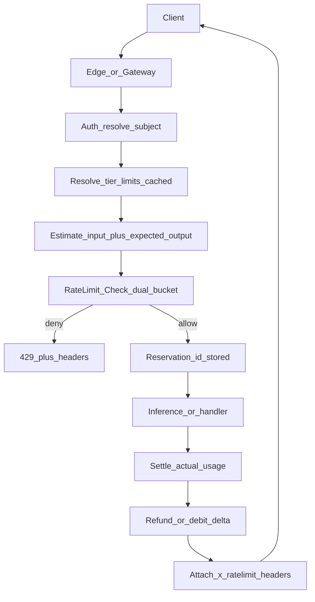
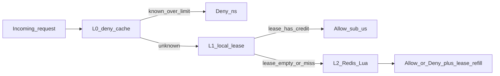

# WHAT_THIS_IS

Dual-dimension (RPM + TPM) distributed rate limiter for LLM and API gateways.  
Library + sidecar, designed to sit on the hot path without becoming slower than the APIs it protects.

---

## What this is

This project is a **production-shaped rate limiting system** that:

- Enforces **request-level** limits (RPM / RPS) and **token-level** limits (TPM) at the same time
- Uses a **dual token-bucket** algorithm with atomic Redis/Valkey Lua updates
- Stays **extremely fast** via a layered path: in-process deny cache → local lease → Redis
- Supports **reserve → execute → settle/refund** so unknown LLM output tokens are accounted correctly
- Emits **OpenAI-compatible** `x-ratelimit-*` headers so clients and SDKs can adapt before they hit 429
- Ships as a **Go library** and a **standalone sidecar** (`valved`) other services can call over HTTP/gRPC

It is meant to be open-sourced so other developers can drop it in front of OpenAI, Anthropic, vLLM, or their own APIs and get the same metering shape providers already use.

---

## What this is not

| Not this | Why |
| --- | --- |
| A full API gateway | Auth, routing, WAF, and TLS termination belong to Kong/Envoy/nginx/your edge |
| A billing ledger | Counters feed rate decisions; invoices and invoices-grade audit trails are out of scope |
| A perfect global consensus system | Multi-region has explicit overshoot / drift tradeoffs; we document them instead of pretending |
| A tokenizer product | We estimate fast on the hot path and settle on real `usage`; we do not replace tiktoken/model tokenizers |
| A model router or queue | Priority queues and multi-model fallback are adjacent systems |
| A sliding-window marketing counter only | Sliding window may be added later as a mode; the core product is dual token bucket |

If removing a feature would not change how RPM/TPM are enforced under concurrency and failure, it does not belong in v1.

---

## The problem

### Request-only limits break for LLMs

A CRUD request has roughly flat cost. An LLM request does not:

- 50-token classifier ping vs 40,000-token document + long completion
- Same path, same headers, orders-of-magnitude different cost, latency, and GPU time

Providers already meter on multiple axes (OpenAI: RPM + TPM; Anthropic: RPM + ITPM + OTPM). A gateway that only counts requests either:

- Allows one mega-prompt to burn the org, or
- Punishes chatty cheap traffic as if it were heavy traffic

### The limiter must be faster than the API

The check runs on **every** request. If p99 of the rate check approaches or exceeds API latency, the limiter is a product regression. Design target: most decisions never leave the process; Redis is the source of truth on lease refresh, not every request.

---

## Algorithms

### Comparison

| Algorithm | Strength | Weakness | Fit for RPM+TPM |
| --- | --- | --- | --- |
| Fixed window | Simple `INCR` + TTL | Boundary double-spend (~2× burst) | Poor as sole algorithm |
| Sliding window log | Exact | O(N) memory/CPU | Poor at scale |
| Sliding window counter | Smooth, cheap | Awkward for weighted token costs | OK for RPM-only |
| Token bucket | Burst + sustained rate; native `AllowN(cost)` | Needs atomic refill+debit | **Best fit** |
| GCRA | Math-equivalent to leaky/token; 1 TAT scalar | Less intuitive API | Good internal impl later |

### Chosen algorithm: dual token bucket

**Optimum for this system: two token buckets per subject**, checked atomically.

1. **RPM bucket** — capacity = burst requests, refill = sustained request rate, cost = `1`
2. **TPM bucket** — capacity = burst tokens, refill = sustained token rate, cost = `estimated_tokens` (then settled to actual)

Allow only if **both** succeed. If either fails → deny with which dimension tripped + `Retry-After`.

**Why not sliding window as primary?** Variable token cost maps cleanly to bucket debit; burst/plan tiers map to capacity vs refill. Sliding window is “count events in a window”; token bucket is “spend budget with controlled replenishment.”

**GCRA note:** GCRA is behaviorally equivalent for many pacing cases and stores one scalar. Public API stays token-bucket shaped (`capacity`, `refill_per_sec`, `cost`). An internal GCRA backend may be swapped in later for memory efficiency without changing callers.

### Bucket math (single dimension)

```
state: tokens ∈ [0, capacity], last_refill_ms

on Check(cost, now):
  elapsed = now - last_refill_ms
  tokens  = min(capacity, tokens + elapsed_sec * refill_per_sec)
  if tokens < cost: deny, compute retry_after from deficit
  else: tokens -= cost; allow; persist tokens, last_refill_ms
```

Dual check runs the same logic for RPM and TPM inside **one** Lua script so concurrent requests cannot debit one bucket and fail the other partially.

---

## How it functions

### Identity and keys

After auth (outside this project), the subject is known: API key, org, user, or tenant. Limits are keyed by:

```
rl:{subject}:{model}:rpm
rl:{subject}:{model}:tpm
```

Optional dimensions: project, tier, endpoint. Redis Cluster uses hash tags `{subject}` so both buckets land on the same slot for multi-key Lua.

### End-to-end flow



### Reserve → settle → refund

Output tokens are unknown until generation finishes. The contract is:

1. **Estimate** — fast heuristic (e.g. chars/4) + `max_tokens` / expected output bound
2. **Check / Reserve** — atomically debit RPM=`1` and TPM=`estimate`
3. **Execute** — call model or handler
4. **Settle** — read provider `usage` (prompt + completion)
   - `actual < reserved` → **refund** difference to TPM
   - `actual > reserved` → debit delta (or accept bounded overshoot; document the bound)
5. **Refund full reservation** on handler failure before any tokens were consumed upstream (policy: fail-safe return of unused budget)

Without reserve/settle, either mega-prompts sneak through (post-only counting) or permanent mis-accounting (estimate-only).

### Hard per-request cap

Independent of the minute budget: reject oversized prompts against context window / plan max **before** reservation (typically `400`/`413`). This is a size gate, not a rate gate.

---

## Architecture

### Latency layers



| Layer | Role | Target latency |
| --- | --- | --- |
| L0 Deny cache | Remember “subject over limit until T” | p99 &lt; 200 ns |
| L1 Local lease | Chunk of RPM/TPM credits borrowed from Redis | p99 &lt; 50 µs |
| L2 Redis Lua | Atomic dual-bucket truth + lease refill | p99 &lt; 1–2 ms |
| Config cache | Tier limits in memory, push/reload | not on critical math path |

### Deployment shapes

1. **Library** — embed in Go gateway / BFF
2. **Sidecar `valved`** — HTTP/gRPC for polyglot services
3. **Edge adapter** — Envoy external rate limit service or middleware that speaks the same API

Redis/Valkey is the shared store. App nodes are stateless except for leases and deny cache.

### Atomic Redis script responsibilities

One `EVALSHA` script:

1. Read both bucket hashes (or init full on cold key)
2. Refill using Redis `TIME` (not skewed app clocks)
3. Check RPM ≥ 1 and TPM ≥ cost
4. Debit both **or neither** (all-or-nothing)
5. Return `{allowed, remaining_rpm, remaining_tpm, retry_after_ms, limit_type}`

Settle/refund are separate small scripts that credit or debit TPM (and never silently invent RPM).

---

## How the system scales

### Local lease (chunk borrowing)

Naive Redis-on-every-request adds ~0.3–1 ms RTT and melts Redis at high QPS.

Lease protocol:

1. Pod asks Redis for `K` request credits and `M` token credits for subject S
2. Further checks decrement **local** memory
3. On empty lease or TTL expiry → refresh from Redis
4. On pod shutdown → return unused lease to Redis

**Overshoot bound (approximate):**

```
max_global_overshoot ≈ num_active_pods × chunk_size
```

Tune `chunk_size` down for billing-strict tenants; up for latency. Target: **~90% of checks never leave the process**.

### Horizontal scale

- Many gateway replicas share one Redis/Valkey cluster
- Shard by `{subject}` hash tag; avoid a single global key
- Hot org keys: sticky routing or finer keying (project/api_key) to spread load
- Connection pools + pipelining; same AZ as Redis when possible

### Multi-region

Default v1 stance: **regional Redis**, regional enforcement. Cross-region:

- Either accept independent regional budgets (simpler, possible 2× if user multi-homes), or
- Active-Active / CRDT with **known drift**

We do not claim strongly consistent global RPM/TPM across continents in v1.

### Latency SLOs (north star)

| Path | SLO |
| --- | --- |
| L0/L1 allow or deny | p99 &lt; 50 µs |
| L2 Redis path | p99 &lt; 1–2 ms |
| Limiter must not block API on metrics flush / GC spikes | best-effort isolation |

---

## Behavior matrix

How the system must behave in each scenario.

| Scenario | Behavior |
| --- | --- |
| Both buckets have credit | Allow; attach remaining/reset headers; create reservation when TPM cost &gt; 0 |
| RPM exhausted, TPM OK | Deny `limit_type=requests`; `Retry-After` from RPM refill; L0 cache deny until reset |
| TPM exhausted, RPM OK | Deny `limit_type=tokens`; same header pattern for tokens |
| Both exhausted | Deny; report the dimension with longer wait (or both in body); `Retry-After` = max needed |
| Cold key (first request) | Initialize buckets full (or at tier capacity); then debit |
| Concurrent requests same subject | Single-threaded Lua on key; no double-spend; losers get deny or retry_after |
| Estimate &lt; actual after response | Debit TPM delta on settle; if delta would go negative past policy floor, allow bounded overshoot once and flag metric |
| Estimate &gt; actual | Refund TPM difference; RPM stays consumed (request happened) |
| Handler error before upstream call | Full refund of reservation (RPM + TPM) per configured policy; default: refund both if request never left the gateway |
| Handler error after upstream consumed tokens | Settle with best-known usage; no fake refund of spent tokens |
| Streaming response | Hold reservation until final `usage` chunk (or disconnect timeout); then settle |
| Redis timeout / down, fail-closed (default for deny-sensitive) | Deny with `503` or `429` + `limit_type=backend`; do not fail open for abuse-sensitive deployments |
| Redis timeout / down, fail-open (explicit config) | Allow using remaining local lease only; when lease empty, allow or deny per config; emit high-severity metric |
| Lease TTL expired with leftover credits | Do not spend stale lease; refresh from Redis; optionally return leftovers on refresh |
| Pod SIGTERM | Best-effort return unused lease to Redis; accept small loss on hard kill |
| Tier upgrade/downgrade mid-flight | New limits apply on next Check; in-flight reservations settle against the reservation snapshot |
| Per-request size over max | Reject before Check (`400`/`413`); no bucket debit |
| Denied request counting | Denied requests do **not** consume RPM/TPM (disable-penalty semantics) |
| Clock skew across app nodes | Lua uses Redis server time for refill |
| Cluster failover | Brief errors → retry once; then fail-closed/open policy; leases may overshoot during partition (bounded by chunk × pods) |

---

## Public API contract

### Core operations

```text
Check(ctx, key, cost) -> Decision
  key:  { subject, model, ... }
  cost: { requests: 1, tokens: estimated }

Settle(ctx, reservation_id, actual_tokens) -> Decision
Refund(ctx, reservation_id) -> error
```

### Decision

```text
Allowed       bool
LimitType     "" | "requests" | "tokens" | "backend"
RemainingRPM  int64
RemainingTPM  int64
LimitRPM      int64
LimitTPM      int64
ResetRPM      time
ResetTPM      time
RetryAfter    duration
ReservationID string   // when Allowed and tokens reserved
```

### HTTP headers (OpenAI-compatible)

On responses (allow or deny where applicable):

| Header | Meaning |
| --- | --- |
| `x-ratelimit-limit-requests` | RPM ceiling |
| `x-ratelimit-remaining-requests` | RPM remaining |
| `x-ratelimit-reset-requests` | When RPM budget recovers enough / window reset signal |
| `x-ratelimit-limit-tokens` | TPM ceiling |
| `x-ratelimit-remaining-tokens` | TPM remaining |
| `x-ratelimit-reset-tokens` | Token budget recovery signal |
| `Retry-After` | Seconds to wait on 429 (minimum; clients should add jitter) |

Status codes:

- `429` — rate limited (RPM or TPM)
- `503` — backend unavailable under fail-closed (configurable alias to 429)
- `400`/`413` — request too large for per-request cap

---

## Observability

Minimum metrics:

- `ratelimit_checks_total{result,limit_type}`
- `ratelimit_settle_total{result}`
- `ratelimit_refund_total`
- `ratelimit_redis_rtt_seconds`
- `ratelimit_lease_hit_ratio`
- `ratelimit_deny_cache_hit_ratio`
- `ratelimit_overshoot_tokens` (settle delta beyond reserve)
- `ratelimit_backend_errors_total`

Logs: structured deny events with subject hash (not raw secrets), model, limit_type, retry_after. Traces: optional span around L2 only (avoid tracing every L0/L1 hit).

---

## Configuration defaults (locked for v1)

| Knob | Default |
| --- | --- |
| Language | Go |
| Store | Redis / Valkey + Lua (`EVALSHA`) |
| Algorithm | Dual token bucket |
| Redis failure | Fail-closed (configurable fail-open) |
| Headers | OpenAI-compatible `x-ratelimit-*` |
| Denied requests | Do not consume budget |
| Estimate | Fast heuristic on Check; exact usage on Settle |
| Lease | Enabled in gateway/sidecar deployments |

---

## Open-source positioning

Many libraries implement generic RPM or a single token bucket. Fewer ship **dual RPM+TPM**, **reserve/settle for LLMs**, **local lease**, and **OpenAI-compatible headers** as one coherent product.

This project’s niche:

> Drop-in dual-dimension rate limiting for AI/API gateways — correct under concurrency, fast on the hot path, honest about failure and overshoot.

Non-goals stay non-goals so the repo remains adoptable.

---

## Glossary

| Term | Meaning |
| --- | --- |
| RPM | Requests per minute (request bucket) |
| TPM | Tokens per minute (token bucket; input+output unless split later) |
| Subject | Authenticated identity used as rate-limit key |
| Lease | Local chunk of budget borrowed from Redis |
| Reservation | Held debit awaiting settle/refund after Check |
| Fail-closed | On store errors, deny traffic |
| Fail-open | On store errors, allow (availability over strictness) |
